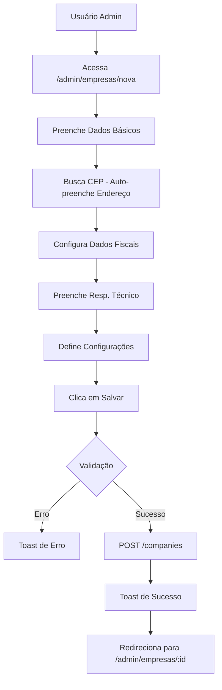

# Criação de Empresas no Painel Admin

## Visão Geral

Implementação completa da funcionalidade de criação de novas empresas no painel administrativo, com todos os campos fiscais necessários para emissão de NF-e.

## Página de Criação

**Localização**: `/app/admin/empresas/nova/page.tsx`

### Estrutura

A página utiliza **Tabs** para organizar os campos em 5 seções:

1. **Dados Básicos** - Informações cadastrais da empresa
2. **Endereço** - Endereço completo com busca automática por CEP
3. **Dados Fiscais** - Configurações para emissão de notas
4. **Responsável Técnico** - Dados obrigatórios desde 01/04/2024
5. **Configurações** - Status e próximos passos

### Campos por Seção

#### 1. Dados Básicos (`dados-basicos`)

| Campo | Tipo | Obrigatório | Descrição |
|-------|------|-------------|-----------|
| `razaoSocial` | Text | ✅ Sim | Nome jurídico completo |
| `nomeFantasia` | Text | Não | Nome comercial |
| `cnpj` | Text (Masked) | ✅ Sim | CNPJ com máscara 00.000.000/0000-00 |
| `inscricaoEstadual` | Text | Não | IE ou "ISENTO" (obrigatório para NF-e) |
| `inscricaoMunicipal` | Text | Não | IM (obrigatório para NFS-e) |
| `cnaePrincipal` | Text | Não | Código CNAE (7 dígitos) |
| `regimeTributario` | Select | ✅ Sim | 1-Simples Nacional, 2-Simples Excesso, 3-Regime Normal |
| `email` | Email | Não | Email da empresa |
| `telefone` | Text (Masked) | Não | Telefone fixo |
| `celular` | Text (Masked) | Não | Celular |
| `site` | URL | Não | Website |

**Validações**:
- CNPJ formatado automaticamente
- Telefones com máscara (11) 3456-7890 / (11) 98765-4321

#### 2. Endereço (`endereco`)

| Campo | Tipo | Obrigatório | Descrição |
|-------|------|-------------|-----------|
| `cep` | Text (Masked) | Não | CEP com busca automática |
| `logradouro` | Text | Não | Rua/Avenida |
| `numero` | Text | Não | Número |
| `complemento` | Text | Não | Complemento |
| `bairro` | Text | Não | Bairro |
| `cidade` | Text | Não | Cidade |
| `estado` | Text | Não | UF (2 caracteres) |
| `codigoMunicipioIBGE` | Text | Não | Código IBGE (7 dígitos) |

**Funcionalidades**:
- ✅ Busca automática de endereço via ViaCEP ao digitar CEP
- ✅ Preenchimento automático do código IBGE via API IBGE
- ✅ Feedback visual durante busca ("Buscando...")
- ✅ Toast de sucesso ao encontrar endereço
- ✅ Campos desabilitados durante busca (CEP e Código IBGE)

**Integração**:
```typescript
const { loading: loadingCEP, fetchCompleteAddress } = useAddressLookup()

const handleCEPChange = async (value: string) => {
  const maskedValue = maskCEP(value)
  setCep(maskedValue)

  if (removeMask(maskedValue).length === 8) {
    const address = await fetchCompleteAddress(maskedValue)
    if (address) {
      // Preenche todos os campos automaticamente
      setLogradouro(address.street)
      setBairro(address.neighborhood)
      setCidade(address.city)
      setEstado(address.state)
      setCodigoMunicipioIBGE(address.ibgeCode)
      
      toast({
        title: 'CEP encontrado!',
        description: 'Endereço preenchido automaticamente.',
      })
    }
  }
}
```

#### 3. Dados Fiscais (`fiscal`)

| Campo | Tipo | Obrigatório | Descrição |
|-------|------|-------------|-----------|
| `cfopPadrao` | Select | Não | CFOP padrão para vendas estaduais |
| `serieNFe` | Text | Não | Série da NF-e (geralmente "1") |
| `ambienteFiscal` | Select | Não | HOMOLOGACAO ou PRODUCAO |

**Opções CFOP**:
- 5101 - Venda de produção própria
- 5102 - Venda de mercadoria adquirida (padrão)
- 5405 - Venda com ST
- 6101 - Venda interestadual produção própria
- 6102 - Venda interestadual mercadoria adquirida

**Alertas**:
```
⚠️ Atenção: Para emitir NF-e em ambiente de Produção, será necessário 
fazer upload do Certificado Digital A1 nas configurações da empresa.
```

#### 4. Responsável Técnico (`responsavel-tecnico`)

| Campo | Tipo | Obrigatório | Descrição |
|-------|------|-------------|-----------|
| `respTecCNPJ` | Text (Masked) | Não | CNPJ da empresa desenvolvedora |
| `respTecContato` | Text | Não | Nome do contato técnico |
| `respTecEmail` | Email | Não | Email do responsável técnico |
| `respTecFone` | Text (Masked) | Não | Telefone do responsável |

**Contexto Legal**:
```
ℹ️ Informação: A SEFAZ exige o preenchimento destes dados em todas as 
NF-e emitidas desde abril de 2024. Informe os dados da empresa responsável 
pelo desenvolvimento ou suporte do sistema.
```

#### 5. Configurações (`configuracoes`)

| Campo | Tipo | Obrigatório | Descrição |
|-------|------|-------------|-----------|
| `active` | Switch | ✅ Sim | Empresa ativa no sistema (padrão: true) |

**Próximos Passos** (após criação):
- ✅ Fazer upload do Certificado Digital A1 (para produção)
- ✅ Configurar impostos e alíquotas padrão
- ✅ Cadastrar usuários e definir permissões
- ✅ Testar emissão de NF-e em homologação

### Submissão do Formulário

```typescript
const handleSubmit = async (e: React.FormEvent) => {
  e.preventDefault()
  setLoading(true)

  try {
    // 1. Validações básicas
    if (!razaoSocial || !cnpj) {
      toast({
        title: 'Campos obrigatórios',
        description: 'Razão Social e CNPJ são obrigatórios.',
        variant: 'destructive',
      })
      return
    }

    // 2. Montar payload (apenas campos preenchidos)
    const payload = {
      razaoSocial,
      cnpj: removeMask(cnpj),
      regimeTributario,
      active,
      // ... campos opcionais
    }

    // 3. Chamar API
    const company = await adminApi.createCompany(payload)

    // 4. Feedback de sucesso
    toast({
      title: 'Empresa criada com sucesso!',
      description: `${company.razaoSocial} foi cadastrada no sistema.`,
    })

    // 5. Redirecionar para página de detalhes
    router.push(`/admin/empresas/${company.id}`)
    
  } catch (error: any) {
    toast({
      title: 'Erro ao criar empresa',
      description: error.response?.data?.message || error.message,
      variant: 'destructive',
    })
  } finally {
    setLoading(false)
  }
}
```

### Máscaras Aplicadas

Todas as máscaras são aplicadas em tempo real:

```typescript
import { maskCNPJ, maskCEP, maskPhone, removeMask } from '@/lib/masks'

// CNPJ: 00.000.000/0000-00
<Input
  value={cnpj}
  onChange={(e) => setCnpj(maskCNPJ(e.target.value))}
  maxLength={18}
/>

// CEP: 00000-000
<Input
  value={cep}
  onChange={(e) => handleCEPChange(e.target.value)}
  maxLength={9}
/>

// Telefone: (11) 3456-7890 ou (11) 98765-4321
<Input
  value={telefone}
  onChange={(e) => setTelefone(maskPhone(e.target.value))}
  maxLength={15}
/>
```

### Estados do Formulário

| Estado | Descrição |
|--------|-----------|
| `loading` | Submissão em andamento (desabilita botão) |
| `loadingCEP` | Busca de CEP/IBGE em andamento |

**Botão de Salvar**:
```tsx
<Button type="submit" disabled={loading}>
  <Save className="h-4 w-4 mr-2" />
  {loading ? 'Salvando...' : 'Salvar Empresa'}
</Button>
```

## API Client

**Localização**: `/lib/api/auth.ts`

### Interface de Request

```typescript
export interface CreateCompanyRequest {
  // Obrigatórios
  razaoSocial: string
  cnpj: string
  regimeTributario: 'SIMPLES_NACIONAL' | 'SIMPLES_NACIONAL_EXCESSO' | 'REGIME_NORMAL'
  active: boolean
  
  // Opcionais - Dados Básicos
  nomeFantasia?: string
  inscricaoEstadual?: string
  inscricaoMunicipal?: string
  cnaePrincipal?: string
  email?: string
  site?: string
  
  // Opcionais - Endereço
  cep?: string
  logradouro?: string
  numero?: string
  complemento?: string
  bairro?: string
  cidade?: string
  estado?: string
  codigoMunicipioIBGE?: string
  
  // Opcionais - Contatos
  telefone?: string
  celular?: string
  
  // Opcionais - Fiscal
  cfopPadrao?: string
  serieNFe?: string
  ambienteFiscal?: 'HOMOLOGACAO' | 'PRODUCAO'
  
  // Opcionais - Responsável Técnico
  respTecCNPJ?: string
  respTecContato?: string
  respTecEmail?: string
  respTecFone?: string
}
```

### Interface de Response

```typescript
export interface CompanyResponse {
  id: string
  razaoSocial: string
  nomeFantasia?: string
  cnpj: string
  inscricaoEstadual?: string
  inscricaoMunicipal?: string
  regimeTributario: string
  email?: string
  telefone?: string
  cidade?: string
  estado?: string
  active: boolean
  createdAt: string
  updatedAt: string
}
```

### Função de Criação

```typescript
export const adminApi = {
  /**
   * Cria uma nova empresa (apenas admin)
   */
  async createCompany(data: CreateCompanyRequest): Promise<CompanyResponse> {
    try {
      const response = await apiClient.post<CompanyResponse>('/companies', data)
      return response.data
    } catch (error: any) {
      throw new Error(error.response?.data?.message || 'Erro ao criar empresa')
    }
  },
}
```

**Uso**:
```typescript
import { adminApi } from '@/lib/api/auth'

const company = await adminApi.createCompany({
  razaoSocial: 'EMPRESA EXEMPLO LTDA',
  cnpj: '12345678000190',
  regimeTributario: 'SIMPLES_NACIONAL',
  active: true,
  nomeFantasia: 'Empresa Exemplo',
  inscricaoEstadual: '123456789',
  // ... outros campos
})
```

## Dependências

### Componentes Shadcn/ui

- `Button` - Botões de ação
- `Card` - Containers de conteúdo
- `Input` - Campos de texto
- `Label` - Rótulos de campos
- `Select` - Dropdowns
- `Tabs` - Navegação em abas
- `Switch` - Toggle on/off
- `useToast` - Notificações

### Hooks Customizados

- `useAddressLookup` - Busca de CEP e código IBGE
- `useToast` - Sistema de notificações
- `useRouter` - Navegação Next.js

### Utilitários

- `maskCNPJ` - Formatar CNPJ
- `maskCEP` - Formatar CEP
- `maskPhone` - Formatar telefone
- `removeMask` - Remover máscaras antes de enviar

### Ícones Lucide

- `ArrowLeft` - Voltar
- `Save` - Salvar
- `Building2` - Dados básicos
- `MapPin` - Endereço
- `FileText` - Dados fiscais
- `Shield` - Responsável técnico
- `Settings` - Configurações

## Fluxo de Uso



## Validações Implementadas

### No Frontend

1. **Campos Obrigatórios**:
   - Razão Social
   - CNPJ
   - Regime Tributário

2. **Formato de Dados**:
   - CNPJ: 14 dígitos com máscara
   - CEP: 8 dígitos com máscara
   - Telefones: 10-11 dígitos com máscara
   - Email: Formato válido de email
   - URL: Formato válido de URL
   - Estado: Exatamente 2 caracteres (UF)
   - Código IBGE: Exatamente 7 dígitos
   - CNAE: Máximo 7 caracteres
   - Série: Máximo 3 caracteres

3. **Máscaras Automáticas**:
   - Todas as máscaras aplicadas em tempo real
   - Apenas números enviados para API (máscaras removidas)

### No Backend (esperado)

- Validação de CNPJ único
- Validação de formato de CNPJ
- Validação de campos obrigatórios
- Validação de regime tributário válido
- Validação de código IBGE existente
- Validação de UF válida

## Melhorias Futuras

### Validação em Tempo Real

```typescript
// Adicionar validação enquanto o usuário digita
const [errors, setErrors] = useState<Record<string, string>>({})

const validateCNPJ = (cnpj: string) => {
  if (!validateCNPJ(cnpj)) {
    setErrors(prev => ({ ...prev, cnpj: 'CNPJ inválido' }))
  } else {
    setErrors(prev => {
      const { cnpj, ...rest } = prev
      return rest
    })
  }
}
```

### Badge de Status de Validação

```tsx
import { CompanyNFeValidationAlert } from '@/components/companies/company-nfe-validation-alert'

// Exibir alertas de validação no topo do formulário
<CompanyNFeValidationAlert company={formData} />
```

### Upload de Logo

```tsx
// Adicionar campo de upload de logo na aba "Dados Básicos"
<div className="space-y-2">
  <Label>Logo da Empresa</Label>
  <Input type="file" accept="image/*" />
</div>
```

### Modo de Edição

```tsx
// Reutilizar o mesmo formulário para edição
const isEditMode = !!companyId

useEffect(() => {
  if (isEditMode) {
    // Carregar dados da empresa
    loadCompany(companyId)
  }
}, [isEditMode, companyId])
```

## Exemplos de Uso

### Exemplo 1: Criar Empresa Simples

```typescript
await adminApi.createCompany({
  razaoSocial: 'LOJA EXEMPLO LTDA',
  cnpj: '12345678000190',
  regimeTributario: 'SIMPLES_NACIONAL',
  active: true,
})
```

### Exemplo 2: Criar Empresa Completa

```typescript
await adminApi.createCompany({
  // Dados Básicos
  razaoSocial: 'EMPRESA EXEMPLO COMERCIO LTDA',
  nomeFantasia: 'Loja Exemplo',
  cnpj: '12345678000190',
  inscricaoEstadual: '123456789',
  inscricaoMunicipal: '54321',
  cnaePrincipal: '4712100',
  regimeTributario: 'SIMPLES_NACIONAL',
  email: 'contato@exemplo.com',
  site: 'https://www.exemplo.com',
  
  // Endereço
  cep: '01310100',
  logradouro: 'Avenida Paulista',
  numero: '1000',
  complemento: 'Sala 200',
  bairro: 'Bela Vista',
  cidade: 'São Paulo',
  estado: 'SP',
  codigoMunicipioIBGE: '3550308',
  
  // Contatos
  telefone: '1134567890',
  celular: '11987654321',
  
  // Fiscal
  cfopPadrao: '5102',
  serieNFe: '1',
  ambienteFiscal: 'HOMOLOGACAO',
  
  // Responsável Técnico
  respTecCNPJ: '98765432000100',
  respTecContato: 'João Silva',
  respTecEmail: 'joao@software.com',
  respTecFone: '11987654321',
  
  // Status
  active: true,
})
```

## Conclusão

A página de criação de empresas está completa com:

✅ Formulário organizado em 5 abas
✅ 30+ campos fiscais necessários para NF-e
✅ Busca automática de CEP com código IBGE
✅ Máscaras em tempo real para todos os campos
✅ Validações básicas no frontend
✅ Feedback visual durante operações assíncronas
✅ Tratamento de erros robusto
✅ API client tipado com TypeScript
✅ Documentação completa
✅ Interface intuitiva com alertas informativos

**Próximas Tarefas**:
1. Criar documentação de validação de produtos
2. Criar documentação de validação de empresas
3. Adicionar testes unitários
4. Adicionar testes de integração
