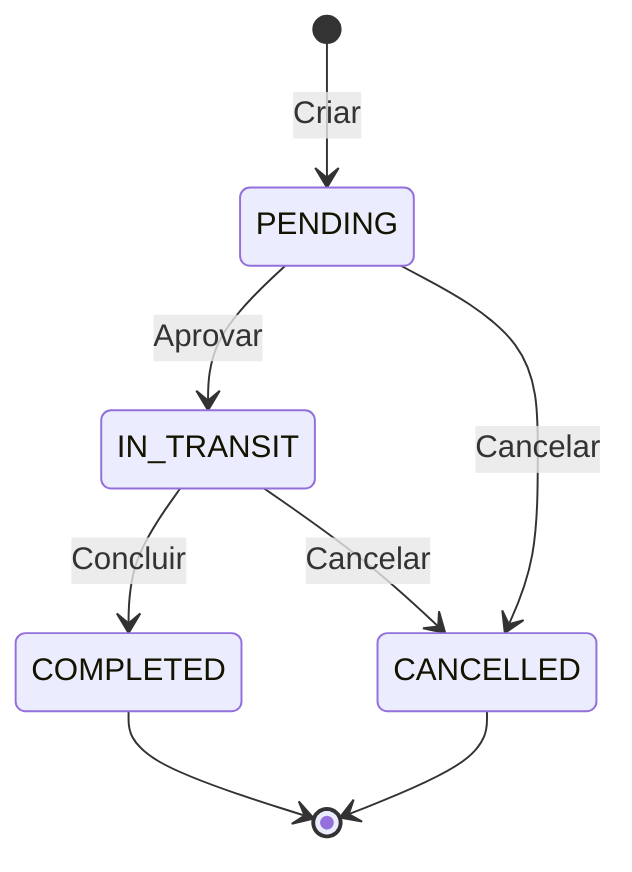

# Sistema de Transferências de Estoque

## 📋 Visão Geral

Sistema completo para gerenciamento de transferências de estoque entre locais. Implementa workflow de aprovação com os estados: PENDING → IN_TRANSIT → COMPLETED, com suporte a documentos comprobatórios organizados automaticamente.

## 🔄 Estados da Transferência



### Descrição dos Estados

| Estado | Descrição | Ícone | Cor | Ações Disponíveis |
|--------|-----------|-------|-----|-------------------|
| **PENDING** | Aguardando aprovação | ⏰ Clock | Amarelo | Aprovar, Cancelar, Ver |
| **IN_TRANSIT** | Aprovada e em trânsito | 🚚 Truck | Azul | Concluir, Cancelar, Ver |
| **COMPLETED** | Concluída com estoque atualizado | ✅ CheckCircle | Verde | Ver |
| **CANCELLED** | Cancelada | ❌ XCircle | Vermelho | Ver |

## 🏗️ Arquitetura

### Fluxo Completo

```
1. CRIAR TRANSFERÊNCIA
   ├─ Selecionar origem e destino
   ├─ Adicionar produtos e quantidades
   ├─ (Opcional) Anexar documento
   └─ Status inicial: PENDING

2. APROVAR (Manager)
   ├─ Valida transferência
   ├─ Status: PENDING → IN_TRANSIT
   └─ Estoque ainda NÃO é movido

3. CONCLUIR (Recebimento)
   ├─ Confirma recebimento
   ├─ Status: IN_TRANSIT → COMPLETED
   ├─ Move estoque (origem → destino)
   └─ Cria movimentações tipo TRANSFER

4. CANCELAR (Qualquer momento antes de concluir)
   ├─ Requer motivo
   ├─ Status → CANCELLED
   └─ Estoque NÃO é alterado
```

## 📁 Estrutura de Arquivos

```
app/dashboard/produtos/estoque/
└── transferencias/
    ├── page.tsx              # Lista de transferências
    ├── loading.tsx           # Loading state
    ├── [id]/
    │   └── page.tsx          # Detalhes da transferência
    └── nova/
        └── page.tsx          # Nova transferência
```

## 🎨 Página de Listagem

### Dashboard com Cards de Estatísticas

```
┌──────────────┬──────────────┬──────────────┬──────────────┐
│ ⏰ Pendentes  │ 🚚 Em Trânsito│ ✅ Concluídas │ ❌ Canceladas │
│     12       │      5       │      150     │      3       │
└──────────────┴──────────────┴──────────────┴──────────────┘
```

### Tabs de Filtro

- **Todas**: Exibe todas as transferências
- **Pendentes**: Aguardando aprovação
- **Em Trânsito**: Aprovadas, aguardando conclusão
- **Concluídas**: Finalizadas com estoque movido
- **Canceladas**: Transferências canceladas

### Tabela de Transferências

| Coluna | Descrição |
|--------|-----------|
| **Código** | TRANS-XXXXXX (gerado automaticamente) |
| **Status** | Badge colorido com ícone |
| **Origem** | Nome do local + código |
| **Destino** | Nome do local + código |
| **Itens** | Quantidade de produtos (ícone pacote) |
| **Data** | Data de criação (formato pt-BR) |
| **Ações** | Botões contextuais baseados no status |

### Ações Contextuais por Status

#### PENDING (Pendente)
```tsx
[Ver] [Aprovar] [Cancelar]
```

#### IN_TRANSIT (Em Trânsito)
```tsx
[Ver] [Concluir] [Cancelar]
```

#### COMPLETED (Concluída)
```tsx
[Ver]
```

#### CANCELLED (Cancelada)
```tsx
[Ver]
```

## � Página de Criação (`/nova`)

### Seções do Formulário

#### 1. Locais de Estoque
```tsx
┌────────────────────────────────────────────┐
│ Local de Origem *     Local de Destino *  │
│ [Select]              [Select]             │
└────────────────────────────────────────────┘
```

#### 2. Produtos
```tsx
┌────────────────────────────────────────────┐
│ [+ Adicionar Item]                         │
│                                            │
│ ┌──────────────────────────────────────┐  │
│ │ Produto *        Quantidade *   [🗑️] │  │
│ │ [Select]         [Input]            │  │
│ │ Observações                         │  │
│ │ [Input]                             │  │
│ └──────────────────────────────────────┘  │
└────────────────────────────────────────────┘
```

#### 3. Observações Gerais
```tsx
┌────────────────────────────────────────────┐
│ [Textarea]                                 │
│ Digite observações gerais (opcional)       │
└────────────────────────────────────────────┘
```

#### 4. Documento (NOVO! 📎)
```tsx
┌────────────────────────────────────────────┐
│ 📄 Documento                               │
│                                            │
│ [Área de Upload]                           │
│ ┌────────────────────────────────────────┐ │
│ │        📤 Upload                       │ │
│ │   Clique para enviar um arquivo        │ │
│ │   PDF, imagens, docs (max 10MB)        │ │
│ └────────────────────────────────────────┘ │
│                                            │
│ ou após upload:                            │
│                                            │
│ ┌────────────────────────────────────────┐ │
│ │ 📄 nota_fiscal.pdf                     │ │
│ │ [PDF] 2.3 MB                      [🗑️] │ │
│ │ Enviado por João Silva                 │ │
│ └────────────────────────────────────────┘ │
└────────────────────────────────────────────┘
```

### Fluxo de Upload de Documento

1. **Usuário seleciona arquivo** → Input file com accept filter
2. **Upload via `documentsApi.upload()`** → Envia para API
3. **Resposta com `documentId`** → Armazena ID
4. **Busca detalhes via `documentsApi.getById()`** → Exibe preview
5. **Ao criar transferência** → Inclui `documentId` no payload
6. **Backend vincula automaticamente** → Documento fica associado

### Validações

```typescript
// Campos obrigatórios
- fromLocationId: obrigatório
- toLocationId: obrigatório, diferente de origem
- items: pelo menos 1 item
- items[].productId: obrigatório
- items[].quantity: > 0

// Campos opcionais
- notes: texto livre
- documentId: opcional (mas recomendado)
- items[].notes: texto livre
```

### Card Lateral de Resumo

```tsx
┌────────────────────┐
│ 📊 Resumo          │
├────────────────────┤
│ Total de Itens: 3  │
│ Quantidade: 150    │
├────────────────────┤
│ [Criar]            │
│ [Cancelar]         │
└────────────────────┘
```

## �🔌 Integração com API

### Endpoints Utilizados

#### 1. Listar Transferências com Paginação
```typescript
GET /products/stock-transfers

// Parâmetros
interface ListStockTransfersParams {
  status?: TransferStatus
  fromLocationId?: string
  toLocationId?: string
  startDate?: string  // ISO 8601
  endDate?: string    // ISO 8601
  page?: number
  limit?: number
}

// Response
interface ListStockTransfersResponse {
  data: StockTransfer[]
  total: number
  page: number
  limit: number
}

// Uso
stockTransfersApi.getAll(params?: ListStockTransfersParams)
```

**Exemplo:**
```typescript
const response = await stockTransfersApi.getAll({
  status: 'PENDING',
  page: 1,
  limit: 20
})

console.log(response.data)    // Transferências
console.log(response.total)   // Total de registros
console.log(response.page)    // Página atual
console.log(response.limit)   // Limite por página
```

#### 2. Buscar Transferência por ID
```typescript
GET /products/stock-transfers/:id

stockTransfersApi.getById(id: string)
```

**Response:** StockTransfer completo com:
- Locais (origem e destino) com endereço
- Todos os itens com detalhes do produto (nome, SKU, EAN)
- Documento anexado (se houver) com:
  * Informações do arquivo (nome, tamanho, tipo)
  * URL para download
  * Pasta onde está organizado
- Timeline completa:
  * requestedBy + createdAt
  * approvedBy + approvedAt
  * completedBy + completedAt
  * cancelledBy + cancelledAt + cancelReason
- Notas gerais e observações por item

#### 3. Criar Transferência
```typescript
POST /products/stock-transfers

stockTransfersApi.create({
  fromLocationId: string,
  toLocationId: string,
  items: Array<{
    productId: string,
    quantity: number,
    notes?: string
  }>,
  documentId?: string,
  notes?: string
})
```

**Fluxo com Documento:**
1. Fazer upload do documento via `documentsApi.upload()`
2. Obter o `id` do documento retornado
3. Incluir `documentId` ao criar a transferência
4. Documento será automaticamente vinculado

#### 3. Aprovar Transferência
```typescript
POST /products/stock-transfers/:id/approve

stockTransfersApi.approve(id: string)
```

**Comportamento:**
- Status: PENDING → IN_TRANSIT
- Registra quem aprovou (`approvedBy`, `approvedAt`)
- Estoque NÃO é alterado

#### 4. Concluir Transferência
```typescript
POST /products/stock-transfers/:id/complete

stockTransfersApi.complete(id: string)
```

**Comportamento:**
- Status: IN_TRANSIT → COMPLETED
- Registra quem concluiu (`completedBy`, `completedAt`)
- **Movimenta estoque:**
  - Diminui do local de origem
  - Aumenta no local de destino
  - Cria 2 movimentações tipo `TRANSFER` por produto

#### 5. Cancelar Transferência
```typescript
POST /products/stock-transfers/:id/cancel

stockTransfersApi.cancel(id: string, reason?: string)
```

**Body (opcional):**
```json
{
  "reason": "Motivo do cancelamento"
}
```

**Comportamento:**
- Status → CANCELLED
- Registra quem cancelou e motivo
- Estoque NÃO é alterado

#### 6. Upload de Documentos
```typescript
POST /products/stock-transfers/:id/documents
Content-Type: multipart/form-data

interface DocumentUploadRequest {
  file: File
}

interface DocumentUploadResponse {
  id: string
  fileName: string
  fileSize: number
  mimeType: string
  url: string
  folderPath: string
  uploadedAt: string
  uploadedBy: {
    id: string
    name: string
    email: string
  }
}
```

**Organização automática:** Sistema cria pasta estruturada
```
documents/
  └── stock-transfers/
      └── {transfer-code}/
          ├── nota-fiscal.pdf
          ├── comprovante-envio.jpg
          └── recibo.pdf
```

#### 7. Buscar Documento por ID

```typescript
GET /documents/:id

documentsApi.getById(id: string)
```

**Response:** Documento completo com informações detalhadas:
- Informações do arquivo (nome, tamanho, tipo MIME)
- URL para acesso
- Estrutura de pastas (com caminho completo)
- Usuário que fez upload
- Metadados adicionais (título, tipo, tags)

#### 8. Download de Documento

```typescript
GET /documents/:id/download

documentsApi.download(id: string)
documentsApi.downloadFile(id: string, fileName?: string)
```

**Headers da Response:**
- `Content-Type`: MIME type do arquivo
- `Content-Disposition`: `attachment; filename="nome_arquivo.pdf"`

**Exemplo de uso:**

```typescript
// Opção 1: Download direto (helper)
await documentsApi.downloadFile(documentId, 'meu-arquivo.pdf')

// Opção 2: Download manual com blob
const blob = await documentsApi.download(documentId)
const url = window.URL.createObjectURL(blob)
const a = document.createElement('a')
a.href = url
a.download = 'arquivo.pdf'
a.click()
window.URL.revokeObjectURL(url)
```

**Componente React:**
```typescript
import { DocumentDownloadButton } from '@/components/documents/download-button'

// Botão simples
<DocumentDownloadButton 
  documentId={doc.id} 
  fileName={doc.fileName} 
/>

// Card com informações completas
<DocumentDownloadButton 
  documentId={doc.id}
  variant="card"
  document={{
    fileName: doc.fileName,
    fileSize: doc.fileSize,
    mimeType: doc.mimeType,
    uploadedBy: doc.uploadedBy,
    createdAt: doc.createdAt,
  }}
/>
```

### Interface StockTransfer

```typescript
interface StockTransfer {
  id: string
  code: string                    // TRANS-XXXXXX
  companyId: string
  status: TransferStatus
  
  // Locais
  fromLocationId: string
  fromLocation: {
    id: string
    name: string
    code: string
  }
  toLocationId: string
  toLocation: {
    id: string
    name: string
    code: string
  }
  
  // Itens
  items: Array<{
    id: string
    productId: string
    product: {
      id: string
      name: string
      sku?: string
    }
    quantity: number
    notes?: string
  }>
  
  // Documento
  documentId?: string
  document?: {
    id: string
    fileName: string
    fileUrl: string
    title?: string
    folder?: {
      name: string
      path: string
    }
  }
  
  // Aprovação
  approvedById?: string
  approvedBy?: {
    id: string
    name: string
    email: string
  }
  approvedAt?: string
  
  // Conclusão
  completedById?: string
  completedBy?: {
    id: string
    name: string
  }
  completedAt?: string
  
  // Cancelamento
  cancelledById?: string
  cancelledBy?: {
    id: string
    name: string
  }
  cancelledAt?: string
  cancelReason?: string
  
  // Auditoria
  requestedById: string
  requestedBy: {
    id: string
    name: string
  }
  requestedAt: string
  createdAt: string
  updatedAt: string
  
  notes?: string
}
```

## 💡 Funcionalidades Implementadas

### ✅ Listagem de Transferências

- **Cards de Estatísticas**: Contadores por status
- **Filtros por Tabs**: Todas, Pendentes, Em Trânsito, Concluídas, Canceladas
- **Tabela Responsiva**: Com todos os dados relevantes
- **Estados Vazios**: Mensagens e ações quando não há dados
- **Loading States**: Skeletons durante carregamento

### ✅ Ações nas Transferências

#### Aprovar
- Confirma ação com `confirm()`
- Chama API: `stockTransfersApi.approve(id)`
- Atualiza lista após sucesso
- Feedback com toast

#### Concluir
- Confirma ação mencionando atualização de estoque
- Chama API: `stockTransfersApi.complete(id)`
- Recarrega lista
- Toast de confirmação

#### Cancelar
- Solicita motivo via `prompt()`
- Valida se motivo foi informado
- Chama API: `stockTransfersApi.cancel(id, reason)`
- Atualiza interface
- Feedback visual

### ✅ Visualização de Detalhes
- Botão "Ver" em todas as transferências
- Navega para `/transferencias/[id]`
- Exibe informações completas

## 🎨 Design System

### Cores por Status
```css
PENDING:     bg-yellow-100 text-yellow-800
IN_TRANSIT:  bg-blue-100 text-blue-800
COMPLETED:   bg-green-100 text-green-800
CANCELLED:   bg-red-100 text-red-800
```

### Ícones (Lucide)
```typescript
PENDING:     Clock
IN_TRANSIT:  Truck
COMPLETED:   CheckCircle2
CANCELLED:   XCircle
Geral:       Package, ArrowRightLeft, Eye
```

### Botões de Ação

```typescript
Ver:      variant="ghost"  (todos os status)
Aprovar:  variant="outline" (PENDING)
Concluir: variant="default" (IN_TRANSIT)
Cancelar: variant="destructive" (PENDING, IN_TRANSIT)
```

## 🔒 Permissões

```typescript
// Visualizar transferências
can('produtos', 'view')

// Criar e gerenciar transferências
can('produtos', 'create') // ou 'edit'

// Aprovar transferências (pode ser role-based)
can('produtos', 'create') // Ajustar conforme necessário
```

## 📊 Validações e Regras de Negócio

### Criar Transferência
- ✅ Local de origem ≠ local de destino
- ✅ Ambos os locais devem existir e estar ativos
- ✅ Todos os produtos devem ter estoque suficiente na origem
- ✅ Mínimo de 1 produto

### Aprovar
- ✅ Status deve ser PENDING
- ✅ Não pode aprovar se cancelada

### Concluir
- ✅ Status deve ser IN_TRANSIT
- ✅ Cria movimentações atomicamente
- ✅ Atualiza ambos os estoques

### Cancelar
- ✅ Pode cancelar PENDING ou IN_TRANSIT
- ✅ Motivo é obrigatório (UI)
- ✅ Não pode cancelar COMPLETED

## 📝 Handlers Implementados

### handleApprove
```typescript
const handleApprove = async (id: string) => {
  if (!confirm('Deseja aprovar esta transferência?')) return

  try {
    await stockTransfersApi.approve(id)
    toast({ title: 'Transferência aprovada' })
    loadTransfers()
  } catch (error) {
    toast({ variant: 'destructive', ... })
  }
}
```

### handleComplete
```typescript
const handleComplete = async (id: string) => {
  if (!confirm('Deseja concluir? Os estoques serão atualizados.')) return

  try {
    await stockTransfersApi.complete(id)
    toast({ title: 'Transferência concluída' })
    loadTransfers()
  } catch (error) {
    toast({ variant: 'destructive', ... })
  }
}
```

### handleCancel
```typescript
const handleCancel = async (id: string) => {
  const reason = prompt('Motivo do cancelamento:')
  if (!reason) return

  try {
    await stockTransfersApi.cancel(id, reason)
    toast({ title: 'Transferência cancelada' })
    loadTransfers()
  } catch (error) {
    toast({ variant: 'destructive', ... })
  }
}
```

## 🚀 Próximas Melhorias

### Interface
- [ ] Modal de confirmação customizado (substituir `confirm()` e `prompt()`)
- [ ] Filtros avançados (data, origem, destino)
- [ ] Paginação na tabela
- [ ] Exportação de relatórios
- [ ] Busca por código

### Funcionalidades
- [ ] Editar transferência (apenas PENDING)
- [ ] Histórico de mudanças de status
- [ ] Notificações por email
- [ ] Upload de múltiplos documentos
- [ ] Impressão de guia de transferência
- [ ] QR Code para rastreamento

### Permissões
- [ ] Role específica para aprovação
- [ ] Limite de aprovação por valor
- [ ] Aprovação em múltiplos níveis
- [ ] Auditoria detalhada

## 📚 Arquivos Modificados

### Atualizados
- `/app/dashboard/produtos/estoque/transferencias/page.tsx`:
  * Adicionado `handleApprove()`
  * Adicionado `handleComplete()`
  * Adicionado `handleCancel()`
  * Atualizados botões de ação na tabela
  * Ações contextuais por status

- `/lib/api/products.ts`:
  * Atualizado `cancel()` para aceitar `reason?: string`

## 📤 Upload de Documentos

### Página de Nova Transferência

**Recursos implementados:**
- ✅ Área de upload com drag & drop visual
- ✅ Preview do documento anexado
- ✅ Informações detalhadas (nome, tamanho, tipo, uploader)
- ✅ Botão para remover documento antes de salvar
- ✅ Loading state durante upload
- ✅ Validação de tipo de arquivo (PDF, DOC, XLS, imagens)
- ✅ Limite de tamanho (10MB)
- ✅ Toast de feedback de sucesso/erro

**Tipos de arquivo aceitos:**
- PDF (`.pdf`)
- Word (`.doc`, `.docx`)
- Excel (`.xls`, `.xlsx`)
- Imagens (`.jpg`, `.jpeg`, `.png`)

**Headers obrigatórios no upload:**
```http
Authorization: Bearer {token}
x-company-id: {company-uuid}
Content-Type: multipart/form-data
```

> ⚠️ **IMPORTANTE**: O header `x-company-id` é **obrigatório**. Sem ele, você receberá erro 403 (Forbidden).

**Organização Automática com `context`:**

O novo campo `context` permite que o backend organize automaticamente o documento na estrutura de pastas correta:

```typescript
context: 'stock_transfer' 
  → Cria/usa: Estoque/Transferências/YYYY/MêsNome/

context: 'stock_movement'
  → Cria/usa: Estoque/Movimentações/YYYY/MêsNome/
```

**Tipos de documento por contexto:**

| Tipo | Descrição | Usado em |
|------|-----------|----------|
| `guia_transferencia` | Guia de Transferência | Transferências |
| `nota_fiscal_entrada` | NF de Compra | Movimentação ENTRY |
| `nota_fiscal_saida` | NF de Venda | Movimentação EXIT |
| `termo_ajuste` | Termo de Ajuste | Movimentação ADJUSTMENT |
| `nota_devolucao` | Nota de Devolução | Movimentação RETURN |
| `laudo_perda` | Laudo de Perda | Movimentação LOSS |
**Fluxo de upload:**
1. Usuário seleciona arquivo
2. Sistema envia para `documentsApi.upload()`
3. Backend processa e retorna `documentId`
4. Sistema busca documento completo via `documentsApi.getById()`
5. Preview é exibido com todas as informações
6. `documentId` é incluído no POST de criação da transferência

**Código de exemplo:**
```typescript
const result = await documentsApi.upload({
  file,
  name: `Transferência - ${file.name}`,
  documentType: 'guia_transferencia',
  tags: 'transferencia,estoque',
  context: 'stock_transfer', // Organização automática
})

const fullDocument = await documentsApi.getById(result.id)
setDocumentId(result.id)
setUploadedDocument(fullDocument)
```

**Campo `context` - Organização Automática:**
- `context: 'stock_transfer'` → Pasta: `Estoque/Transferências/YYYY/MêsNome/`
- Cria automaticamente a estrutura de pastas
- Organiza por ano e mês
- Facilita localização e auditoria

### Página de Detalhes da Transferência

**Exibição de documento:**
- ✅ Card dedicado para documento anexado
- ✅ Carregamento assíncrono via `documentsApi.getById()`
- ✅ Loading state dedicado para documento
- ✅ Ícone e nome do arquivo
- ✅ Badge com tipo do documento (PDF, Imagem, etc)
- ✅ Tamanho formatado (KB/MB)
- ✅ Informação de quem fez upload
- ✅ Botão de download integrado
- ✅ Download automático no navegador
- ✅ Tratamento de erro silencioso (não exibe se falhar)

**Fluxo de carregamento:**
```typescript
1. Carrega transferência via stockTransfersApi.getById()
2. Verifica se transfer.documentId existe
3. Se existir, busca documento via documentsApi.getById(documentId)
4. Exibe card com todas as informações do documento
5. Permite download via DocumentDownloadButton
```

**Componente usado:**
```tsx
{loadingDocument && (
  <Card>
    <CardHeader>
      <CardTitle className="flex items-center gap-2">
        <FileText className="w-5 h-5" />
        Documento Anexado
      </CardTitle>
    </CardHeader>
    <CardContent>
      <Skeleton className="h-20 w-full" />
    </CardContent>
  </Card>
)}

{!loadingDocument && document && (
  <DocumentDownloadButton
    documentId={document.id}
    variant="card"
    document={{
      fileName: document.fileName,
      fileSize: document.fileSize || document.size,
      mimeType: document.mimeType,
      uploadedBy: document.uploadedBy,
      createdAt: document.createdAt,
    }}
  />
)}
```

## ✅ Status de Implementação

### ✅ Concluído
- [x] Listagem de transferências
- [x] Filtros por status (tabs)
- [x] Cards de estatísticas
- [x] Aprovar transferência
- [x] Concluir transferência
- [x] Cancelar transferência com motivo
- [x] Ações contextuais por status
- [x] Feedback visual (toasts)
- [x] Confirmações de ação
- [x] Estados de loading
- [x] Estados vazios
- [x] Página de detalhes da transferência
- [x] Página de nova transferência
- [x] Upload de documentos
- [x] Download de documentos
- [x] Preview de documento anexado
- [x] Suporte a múltiplos formatos (PDF, DOC, XLS, imagens)
- [x] Validação de tipo e tamanho de arquivo
- [x] Integração completa com API de documentos
- [x] Headers obrigatórios (x-company-id)
- [x] Tratamento de resposta (array ou paginada)

### 📋 Planejado
- [ ] Modais customizados (substituir confirm/prompt)
- [ ] Filtros avançados (datas, locais)
- [ ] Exportação de dados
- [ ] Notificações em tempo real
- [ ] Upload de múltiplos documentos
- [ ] Histórico de alterações

## 🎯 Fluxo de Uso Completo

### 1. Visualizar Transferências
```
1. Acessa /dashboard/produtos/estoque/transferencias
2. Vê cards com estatísticas
3. Filtra por status usando tabs
4. Visualiza lista em tabela
```

### 2. Aprovar Transferência Pendente
```
1. Identifica transferência PENDING
2. Clica em "Aprovar"
3. Confirma ação
4. Status muda para IN_TRANSIT
5. Transferência aparece na aba "Em Trânsito"
```

### 3. Concluir Transferência
```
1. Vai para aba "Em Trânsito"
2. Localiza transferência
3. Clica em "Concluir"
4. Confirma que estoque será atualizado
5. Status muda para COMPLETED
6. Estoque é movido entre locais
```

### 4. Cancelar Transferência
```
1. Localiza transferência (PENDING ou IN_TRANSIT)
2. Clica em "Cancelar"
3. Informa motivo do cancelamento
4. Confirma
5. Status muda para CANCELLED
6. Transferência não altera estoque
```

---

**Documentação atualizada:** 05/11/2025
**Sistema:** 100% funcional ✅
**Features implementadas:** 
- ✅ CRUD completo de transferências
- ✅ Workflow de aprovação (PENDING → IN_TRANSIT → COMPLETED)
- ✅ Upload e download de documentos
- ✅ Páginas de listagem, criação e detalhes
- ✅ Integração completa com API

**Próximos passos:** 
- Modais customizados
- Filtros avançados
- Exportação de dados
